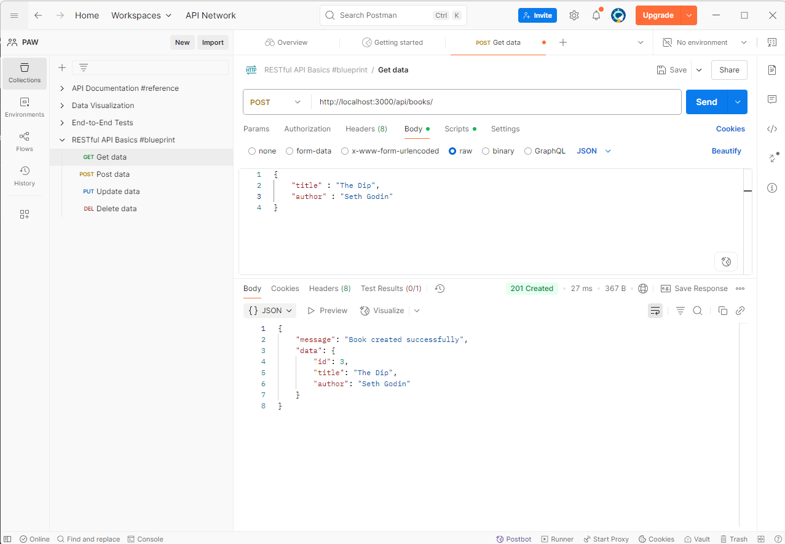
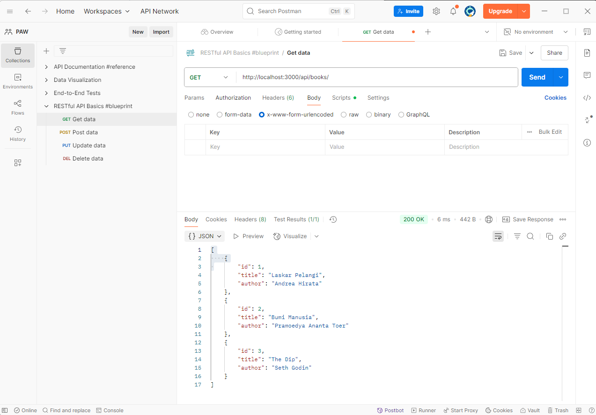
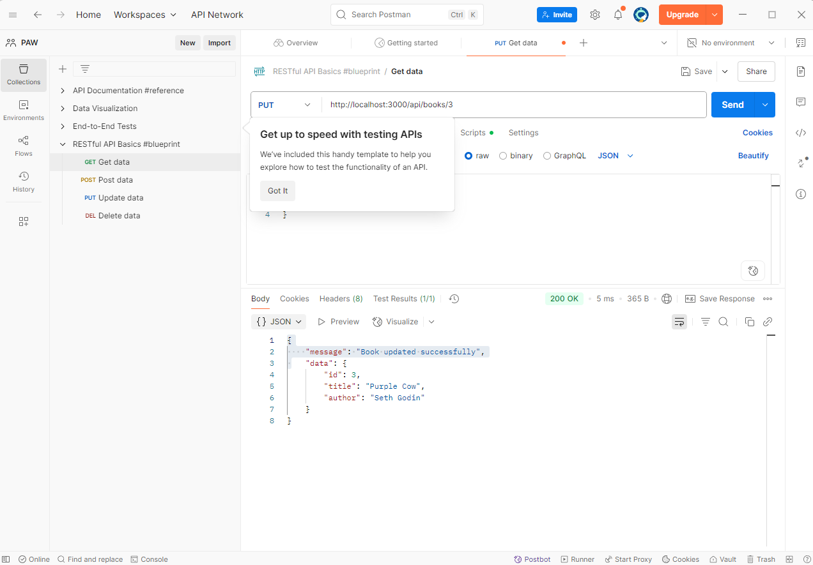
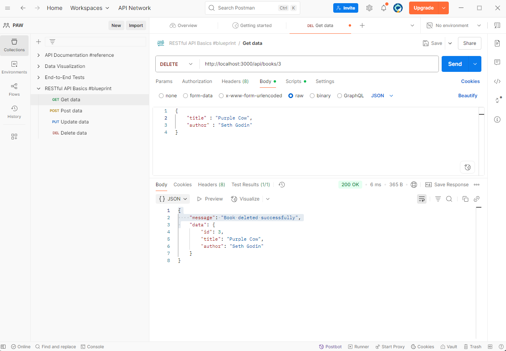
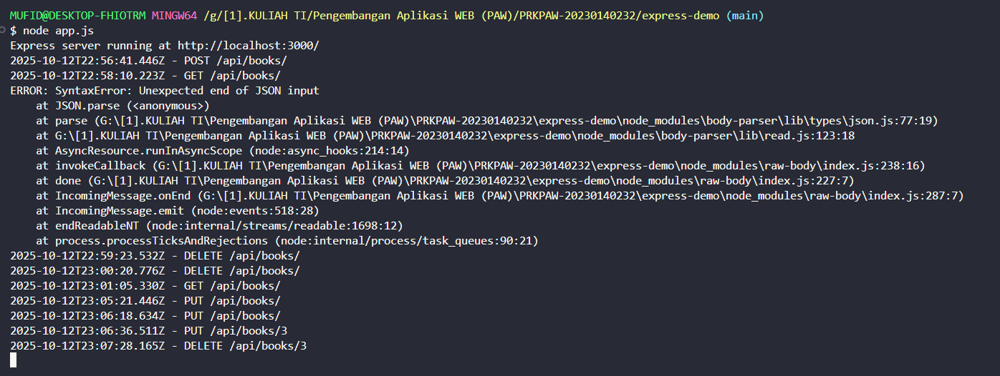

# Tugas 2

## 1. Tampilan Endpoint Create Book

## 2. Tampilan Endpoint Read Book

## 3. Tampilan Endpoint Update Book

## 4. Tampilan Endpoint Delete Book

## Tampilan Middleware pada terminal
 
<<<<<<< HEAD

=======
>>>>>>> 9bcdc0c889c5e9a0b92395e1a61b274e3f3b6598
