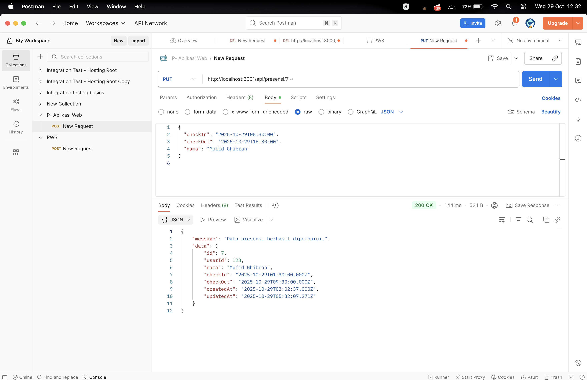
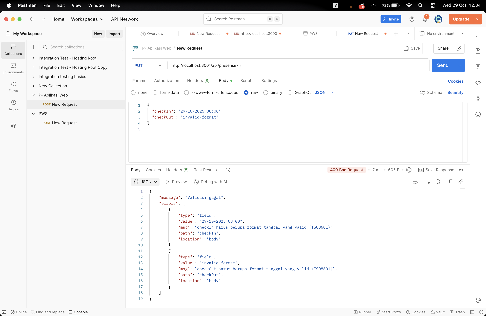
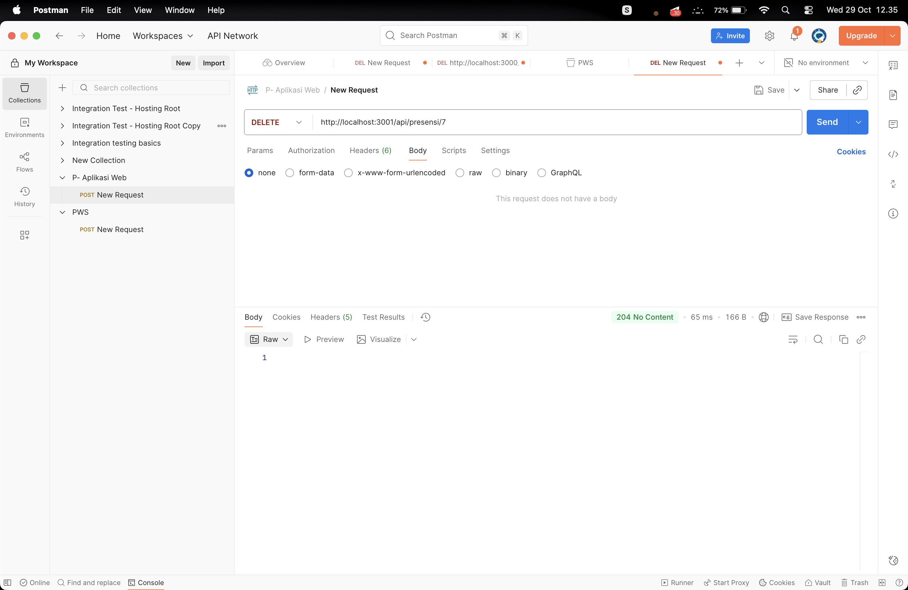
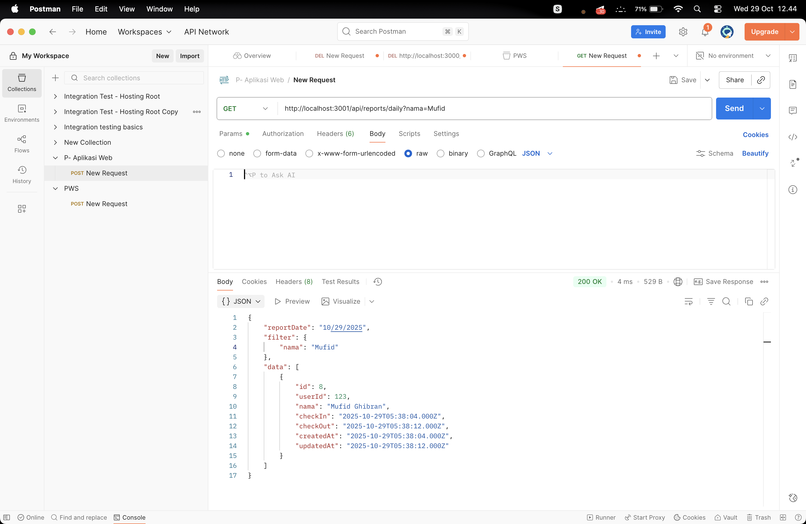
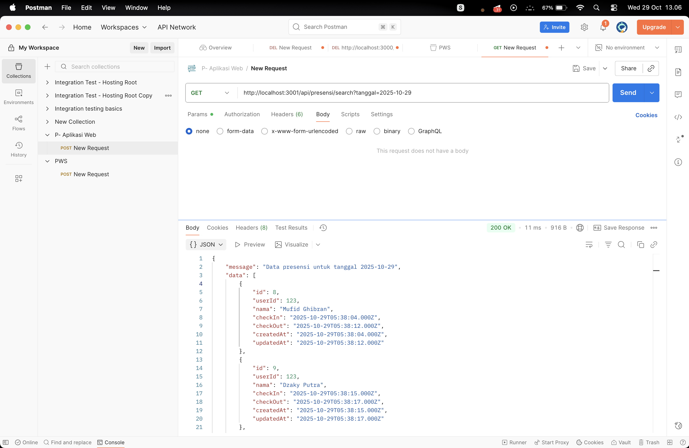

# 📘 Dokumentasi API Presensi

Folder screenshot: `Tugas5-ss/`  
Berikut hasil pengujian endpoint menggunakan Postman, disertai gambar `img1.png` hingga `img5.png` sesuai urutan.

---

## 1️⃣ Endpoint Update Data Presensi  
**Method:** `PUT`  
**URL:** `http://localhost:3001/api/presensi/:id`  
**Deskripsi:** Memperbarui data presensi (checkIn, checkOut, atau nama).  

📸 **Screenshot:**  

---

## 2️⃣ Endpoint Update Jika Format Tanggal Tidak Valid  
**Method:** `PUT`  
**URL:** `http://localhost:3001/api/presensi/:id`  
**Deskripsi:** Menampilkan pesan error jika input `checkIn` atau `checkOut` tidak sesuai format tanggal ISO8601.  

📸 **Screenshot:**  

---

## 3️⃣ Endpoint Delete Data  
**Method:** `DELETE`  
**URL:** `http://localhost:3001/api/presensi/:id`  
**Deskripsi:** Menghapus data presensi berdasarkan `id`.  

📸 **Screenshot:**  

---

## 4️⃣ Endpoint Search Berdasarkan Nama  
**Method:** `GET`  
**URL:** `http://localhost:3001/api/reports/daily?nama=Mufid`  
**Deskripsi:** Menampilkan daftar presensi berdasarkan nama tertentu.  

📸 **Screenshot:**  

---

## 5️⃣ Endpoint Search Berdasarkan Tanggal  
**Method:** `GET`  
**URL:** `http://localhost:3001/api/presensi/search?tanggal=2025-10-29`  
**Deskripsi:** Menampilkan daftar presensi berdasarkan tanggal tertentu.  

📸 **Screenshot:**  

---

🧑‍💻 **Dibuat oleh:** Mufid  
📂 **Project:** API Presensi (Node.js + Express + Sequelize)
